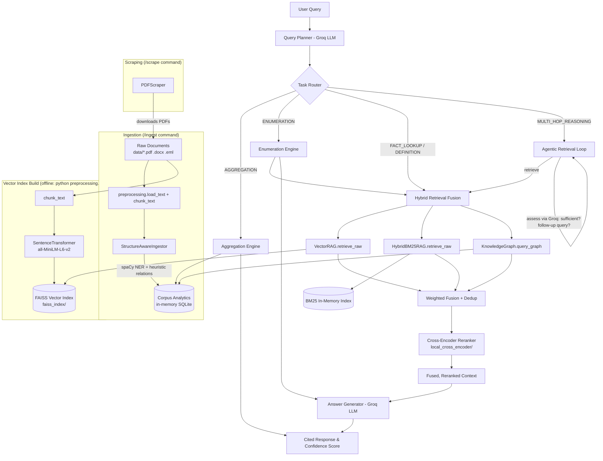

# Unified Multi-RAG Chatbot

An advanced, agentic, structure-aware RAG pipeline designed to handle complex queries, aggregations, enumerations, and multi-hop reasoning across arbitrary document collections (PDF, DOCX, EML).

## About This Project

Standard RAG chatbots work by embedding a user's question, pulling back the top-K "semantically similar" chunks from a vector store, and handing them to an LLM to synthesize an answer. That approach is fine for simple fact lookups, but it breaks down on several common classes of real-world questions:

- **Counting questions** ("How many vendors are mentioned across these contracts?") — a top-K similarity search has no notion of a complete count; it just returns *some* relevant chunks, not *all* of them.
- **Enumeration questions** ("List every clause that references termination rights.") — the same limitation applies: partial retrieval means a partial, silently incomplete list.
- **Multi-hop reasoning** ("Who approved the agreement that superseded the 2022 contract?") — answering this requires chaining facts across multiple documents, which a single retrieval pass cannot do.
- **Trust and verifiability** — a chatbot that answers confidently without citing its sources, or without any signal of how confident it actually is, is not usable in domains where correctness matters.

This project exists to solve those gaps by treating "RAG" as a family of retrieval strategies rather than a single technique, and by routing each query to the strategy suited to it:

1. **Classify the query first.** An LLM-based Query Planner categorizes every incoming question as `FACT_LOOKUP`, `AGGREGATION`, `ENUMERATION`, `MULTI_HOP_REASONING`, or `DEFINITION` before any retrieval happens.
2. **Answer counting and listing questions deterministically.** During ingestion, the pipeline extracts entities and relationships (via spaCy NER plus heuristic pattern extraction) into a structured, queryable Corpus Analytics index. Aggregation and Enumeration questions are answered directly from this structured index, so counts and lists are exhaustive and correct rather than approximated from a handful of retrieved chunks.
3. **Fuse multiple retrieval signals for fact lookups.** Vector search (FAISS), lexical/keyword search (BM25), and 1-hop knowledge graph facts are combined, weighted, deduplicated, and reranked with a cross-encoder — so an answer isn't at the mercy of any single retrieval method's blind spots.
4. **Chase multi-hop questions with an agentic loop.** For questions that require connecting facts across documents, an `AgenticRetriever` performs repeated rounds of retrieval, asking the LLM after each round whether the accumulated context is sufficient or what to search for next — continuing until it has enough evidence or hits a configured step limit.
5. **Make every answer verifiable.** The Answer Generator enforces inline `[Source: File.pdf]` citations on every claim and computes a heuristic confidence score from citation coverage, context size, and detection of denial/uncertainty phrasing, so the chatbot's confidence is visible rather than assumed.

The result is a chatbot built specifically for querying document collections (contracts, reports, policies, correspondence) where users need precise counts, complete lists, cross-document reasoning, and traceable citations — not just plausible-sounding prose.

## Core Features

- **Query Planner:** LLM-based query classification (`FACT_LOOKUP`, `AGGREGATION`, `ENUMERATION`, `MULTI_HOP_REASONING`, `DEFINITION`) via Groq, with a regex-based fallback if the LLM call fails, used to route queries to the correct engine.
- **Structure-Aware Ingestion:** Uses spaCy (`en_core_web_sm`) NER plus a heuristic "X is a Y" pattern extractor to populate an in-memory SQLite entity/relationship index (`data/corpus_analytics.json`).
- **Corpus Analytics:** The SQLite-backed index answers precise counting ("How many?") and listing ("Show all") questions deterministically via the Aggregation and Enumeration engines.
- **Hybrid Retrieval Fusion:** Merges Vector Search (FAISS, `retrieve_raw` on `VectorRAG`), Lexical Search (BM25, `retrieve_raw` on `HybridBM25RAG`), and 1-hop Knowledge Graph facts, min-max normalizes and weights the three signals, dedupes, then reranks with a local Cross-Encoder.
- **Agentic Retrieval:** For multi-hop queries, `AgenticRetriever` runs repeated hybrid-retrieval steps (up to `AGENTIC_MAX_STEPS`), asking Groq after each step whether the accumulated context is sufficient or what follow-up query to issue next.
- **Evidence-Based Generation:** `AnswerGenerator` enforces `[Source: File.pdf]` citations and derives a heuristic confidence score from citation coverage, context size, and denial-phrase detection.

## Architecture Diagram



## Setup & Installation

1. **Install Dependencies:**
   ```bash
   pip install -r requirements.txt
   python -m spacy download en_core_web_sm
   ```

2. **Environment Variables:**
   Create a `.env` file with your Groq API key:
   ```env
   GROQ_API_KEY=your_key_here
   ```

3. **Build the FAISS Vector Index:**
   Place your source documents (`.pdf`, `.docx`, `.eml`) in `data/`, then build the vector index used by `VectorRAG` (writes `faiss_index/index.faiss` and `faiss_index/chunks.pkl`):
   ```bash
   python preprocessing.py
   ```

4. **Run the Pipeline:**
   ```bash
   python main.py
   ```
   On first run, use `/ingest` inside the chatbot to build the Corpus Analytics entity/relationship index (used by the Aggregation, Enumeration, and Knowledge Graph engines).

## Usage Commands

Once running, you can interact with the chatbot using the following commands:
- `💬 Your query:` - Standard conversational RAG query, routed automatically by the Query Planner.
- `/plan <query>` - See the internal Query Plan (category, entities, whether the agentic loop will run) before answering.
- `/ingest` - Process documents in the `data/` folder and (re)build the Corpus Analytics entity/relationship index.
- `/scrape <URL>` - Download PDFs from a website into the `data/` folder.
- `q`, `quit`, `exit` - Exit the chatbot.

## Configuration
All hyperparameters (retrieval depth, fusion weights, agentic limits, scoring weights) are centralized in `config/pipeline_config.py`. They can be overridden using environment variables, e.g.:
- `RETRIEVAL_TOP_K`, `RETRIEVAL_RERANK_K`, `RETRIEVAL_CANDIDATE_POOL`
- `FUSION_VECTOR_WEIGHT`, `FUSION_BM25_WEIGHT`, `FUSION_GRAPH_WEIGHT`
- `PLANNER_ENABLED`, `PLANNER_MODEL`
- `AGENTIC_ENABLED`, `AGENTIC_MAX_STEPS`
- `GROQ_MODEL`, `EMBEDDER_MODEL`, `CROSS_ENCODER_MODEL`, `DEVICE`

## Project Layout

- `main.py` - CLI entry point; wires up and orchestrates all components (`UnifiedRAGPipeline`).
- `core/` - Query planner, hybrid retrieval fusion, aggregation/enumeration engines, knowledge graph, agentic retriever, answer generator.
- `config/pipeline_config.py` - Centralized, env-overridable configuration.
- `query_final.py` / `query_with_BM25.py` - Base retrievers (`VectorRAG`, `HybridBM25RAG`); only their `retrieve_raw()` methods are used by the hybrid fusion layer. Their standalone CLI/`query_pipeline()` paths are legacy and not used by `main.py`.
- `preprocessing.py` - Document loading/chunking (`load_text`, `chunk_text`) and the offline FAISS index build script.
- `web_scraper.py` - `PDFScraper`, used by the `/scrape` command.
- `data/` - Source documents plus the persisted Corpus Analytics snapshot (`corpus_analytics.json`).
- `faiss_index/`, `local_cross_encoder/` - Persisted vector index and local cross-encoder model used at runtime.

### Not wired into the main pipeline
The following modules exist in the repo but are not imported by `main.py` or any `core/` module — they are standalone/legacy code kept for reference:
- `dynamic_kg/dynamic_kg_pipeline.py` - a self-contained alternative FAISS+cross-encoder RAG pipeline.
- `validators/*.py` - a groundedness/consensus/retrieval evaluation pipeline, only used internally within `validators/`.
- `utils/query_intelligence.py` - an earlier Groq-based intent classifier superseded by `core/query_planner.py`.
- `query_final_KG.py` - unreferenced anywhere in the codebase.
